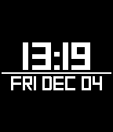

# Square for Pebble 
by Turner Vink 
www.turnervink.com

* Pick any text or background colour on Basalt/Chalk
* Invert colours on Aplite
* Current temperature and conditions can be shown when you flick your wrist,  all the time, or not at all
* Middle bar can be static or reflect battery
* Bluetooth connection indicator with optional vibrations on dis/reconnected
* Current supports English, French, Spanish, and German

Download on the Pebble app store:
https://apps.getpebble.com/applications/552597c506e80c0a4b00007f
